# Der Einfluss des TV-Duell zur Bundestagswahl 2013 auf die individuelle  Wählerwahrnehmung der Spitzenkandidaten 
### Eine explorative Datenanalyse mit R und sentiWS

Die nachfolgende Analyse entstand ursprünglich als Hausarbeit für den Kurs "Wissenschaftliches Programmieren mit R" von Andreas Blätte an der Universität Duisburg-Essen im Wintersemester 2017/18 und wird hier unverändert wiedergegeben.

Die Analyse wurde mit [R Markdown](https://rmarkdown.rstudio.com/) und ist komplett reproduzierbar mittels des [bereitgestellten Skripts](TV-Duell_2013_Florian_Gilberg.Rmd). Hierzu müssen lediglich die Umfragedatensätze von der Website des GESIS (https://dbk.gesis.org/dbksearch/download.asp?db=E&id=56510) heruntergeladen und in den Ordner *dirSPSSFiles* gespeichert werden, da der Abruf der Dateien einen persönlichen Login erfordert und somit nicht automatisch aus R heraus erfolgen kann.

Die interaktive Ansicht der [HTML-Version dieses Dokumentes](TV-Duell_2013_Florian_Gilberg.html) wird empfohlen.

Inhaltsverzeichnis
=================

   * [Einleitung](#einleitung)
      * [Forschungsstand und Hypothesenbildung](#forschungsstand-und-hypothesenbildung)
      * [Datenbasis und Aufbau der Arbeit](#datenbasis-und-aufbau-der-arbeit)
   * [Import und Konvertierung der Datensätze](#import-und-konvertierung-der-datensätze)
   * [Deskriptive Statistiken](#deskriptive-statistiken)
      * [Alter der Probanden](#alter-der-probanden)
      * [Geschlecht und Einkommen](#geschlecht-und-einkommen)
      * [Bildungsniveau](#bildungsniveau)
      * [Parteipräferenz](#parteipräferenz)
         * [Parteipräferenz nach Alter](#parteipräferenz-nach-alter)
         * [Politisches Interesse nach Alter](#politisches-interesse-nach-alter)
   * [Einfluss des TV-Duells 2013 auf die Studienteilnehmer](#einfluss-des-tv-duells-2013-auf-die-studienteilnehmer)
      * [Einfluss auf die Absicht wählen zu gehen](#einfluss-auf-die-absicht-wählen-zu-gehen)
      * [Einfluss auf die Sicherheit der Wahlentscheidung](#einfluss-auf-die-sicherheit-der-wahlentscheidung)
         * [Sankey-Diagramm](#sankey-diagramm)
         * [Sicherheit der Wahlentscheidung vor und nach dem TV-Duell](#sicherheit-der-wahlentscheidung-vor-und-nach-dem-tv-duell)
   * [Einfluss des TV-Duells auf die Wahrnehmung der Kandidaten](#einfluss-des-tv-duells-auf-die-wahrnehmung-der-kandidaten)
      * [Eigenschaften von Angela Merkel](#eigenschaften-von-angela-merkel)
         * [Positive Eigenschaften](#positive-eigenschaften)
         * [Negative Eigenschaften](#negative-eigenschaften)
      * [Eigenschaften von Peer Steinbrück](#eigenschaften-von-peer-steinbrück)
         * [Positive Eigenschaften](#positive-eigenschaften-1)
         * [Negative Eigenschaften](#negative-eigenschaften-1)
   * [Sentimentanalyse mit sentiWS](#sentimentanalyse-mit-sentiws)
      * [Rohdaten der Analyse](#rohdaten-der-analyse)
      * [Grafische Aufbereitung und Vergleich der Kandidatenwerte](#grafische-aufbereitung-und-vergleich-der-kandidatenwerte)
         * [Angela Merkel](#angela-merkel)
         * [Peer Steinbrück](#peer-steinbrück)
   * [Fazit und Ausblick](#fazit-und-ausblick)
   * [Literaturverzeichnis](#literaturverzeichnis)


# Einleitung


 Abbildung 1: Kandidaten und Moderatoren des TV-Duell 2013 in der Übersicht [@heuser_tv-duell_2013]

In der Schlussphase des Bundestagswahlkampfs Jahres 2013 lieferten sich die beiden Spitzenkandidaten und Anwärter auf das Amt der Bundeskanzlerin beziehungsweise des Bundeskanzlers, *Angela Merkel* und *Peer Steinbrück*, ein *Kopf-an-Kopf-Rennen* um die letzten Wähler*Innenstimmen. Als formeller Höhepunkt dieses Kräftemessens galt das drei Wochen vor der Wahl stattfindende TV-Duell zwischen den beiden Spitzenpolitikern, in welchem sich die jeweiligen Bewerber um das Kanzleramt seit mehreren Jahren auch im deutschen Fernsehen ein Duell um die Gunst des Wählers liefern.
Die ursprünglich amerikanische Idee Bewerber um das Präsidentenamt live im Fernsehen gegeneinander antreten zu lassen, hat auch in Deutschland seit 2002 Fuß gefasst [@dehm_fernsehduelle_2002]. 
Für den Wähler bietet dieses TV-Format einige bedeutsame Möglichkeiten: So werden innerhalb eines vorher festgelegten Rahmens in 90 Minuten die wichtigsten Themenkomplexe des jeweiligen Wahlkampfes konzentriert abgefragt und dem Zuschauer werden die Hauptstandpunkte der Spitzenkandidaten zu diesen Themen in verständlicher und unkomplizierter Form aufgezeigt. Das Format des TV-Duells kann nicht nur zur Profilschärfung der Kandidaten beitragen, sondern auch nachweislich den Aufbau politischen Wissens fördern [@maier_basis_2007].

## Forschungsstand und Hypothesenbildung

Im Rahmen dieser Arbeit soll das genannte TV-Duell des Jahres 2013 und dessen Auswirkungen auf den Eindruck der Zuschauer über die Spitzenkandidaten näher untersucht werden. Hierzu existiert eine breite Palette wissenschaftlicher Publikationen mit unterschiedlichen Schwerpunkten, welche sich grob in vier Forschungsstränge unterteilen lassen [@maier_aufgeholt_2014-1]:

1. Die *Inhaltsanalyse* der TV-Duelle befasst sich mit dem Inhalt, Mimik und Gestik der "Wortgefechte" und analysiert beispielsweise Argumentationsstruktur, Rhetorik und Körpersprache.
2. Der zweite Forschungsstrang befasst sich mit der *Berichterstattung der (Massen-)Medien* über das TV-Duell. Hier steht vor allem die öffentliche Rezeption und Struktur der Berichterstattung im Vordergrund.
3. Als Drittes ist die Analyse der *Wirkung von TV-Duellen* zu nennen. Hierzu existiert eine breite Palette von Forschungsliteratur auch im deutschsprachigen Raum [@dehm_tv_2009]. Im Fokus steht vor allem der Einfluss der TV-Duelle auf Wahlabsicht und Eindruck der Kandidaten.
4. Schließlich beschäftigt sich der letzte Forschungsstrang mit der *Echtzeitwahrnehmung* des TV-Duells. Hierbei steht das psychologische Erkenntnisinteresse im Vordergrund und es wird versucht, mittels sogenannter *Real-Time-Response-Mechanismen* oder Twitter-Analysen die positiven und negativen Effekte der Kandidaten bis auf die Wortebene hinunterzubrechen. 

Nach dieser Klassifikation lässt sich die Untersuchung dieser Arbeit in den Bereich der *Wirkung* von TV-Duellen einordnen. Hierbei soll jedoch der bereits vorhandene Forschungsstand um eigene Komponenten erweitert werden. Hierzu werden folgende Hypothesen aufgestellt:

(@) Es besteht ein messbarer Effekt des TV-Duells 2013 auf die Sicherheit der Zuschauer in Bezug auf ihre Wahlentscheidung.

Zuvor in ihrer Wahlentscheidung unsichere Wähler festigen durch den Konsum des TV-Duells ihre Wahlentscheidung, da sie von den Kandidaten entweder positiv angetan oder negativ abgeschreckt werden.

(@) Die direkte Auseinandersetzung mit dem jeweiligen Spitzenkandidaten im Originalton des TV-Duells beeinflusst den Eindruck des Kandidaten auf den Zuschauer positiv.

Das TV-Duell bietet anders als übliche politische TV-Berichterstattung einen spannenden und zugespitzten Livezugang zu, für die eigene Wahlentscheidung relevanten, Informationen. Auch wenn ein Zuschauer im Schnitt vor dem TV-Duell einen nicht sonderlich positiven Eindruck der beiden Kandidaten hatte, beeinflusst laut dieser Hypothese die 90-minütige Debatte diesen Eindruck positiv.

## Datenbasis und Aufbau der Arbeit

Die Prüfung dieser Hypothesen erfolgt auf Grundlage einer Erhebung des Leibniz-Institutes für Sozialwissenschaften (GESIS) zum TV-Duell 2013 (vgl. @rattinger_tv-duell-analyse_2015). In der aufwendigen Erhebung wurden in vier Befragungswellen insgesamt 268 Probanden auf Basis eines Quotenplans rekrutiert. Die Probanden wurden am Tag des Fernsehduells in die Räume der jeweiligen Universität eingeladen, wo diese jeweils vor und unmittelbar nach dem Ansehen beziehungsweise Anhören des Fernsehduells einen Fragebogen ausfüllen mussten. Anschließend wurden im Abstand von etwa einer Woche und etwa einem Monat zwei Fragebögen postalisch an die Probanden versandt und um eine Rücksendung gebeten. Von besonderem Interesse ist in dieser Arbeit die Veränderung der Antworten der Teilnehmer zwischen dem ersten Fragebogen vor und dem zweiten Fragebogen nach Erlebnis des TV-Duells, weshalb diese beiden Befragungswellen auch die Datengrundlage dieser Arbeit bilden.

In einem ersten Schritt werden zunächst die Daten der Studie importiert und in ein für R lesbares Format konvertiert sowie in getrennte Datensätze für beide Befragungswellen aufgeteilt.

Daraufhin werden zunächst deskriptive Statistiken über die Auswahlgesamtheit der Studienteilnehmer erhoben und miteinander in Relation verknüpft. Hierbei handelt es sich um die allgemeinen Basisdaten wie *Alter*, *Geschlecht*, *Bildungsstand* und *Einkommen*. In den Fokus genommen wird zudem die *Parteipräferenz* der Probanden, sofern diese von ihnen genannt wurde sowie das Verhältnis von *Alter* und *Parteipräferenz*.

Im Hauptteil der Arbeit wird der Einfluss des TV-Duells auf verschiedene Faktoren untersucht. Hierzu zählt der Einfluss auf die *Absicht wählen zu gehen*, der Einfluss auf die *Sicherheit der Wahlsicht*, welcher mittels eines interaktiven Sankey-Netzwerkdiagrammes (in der HTML-Version) visualisiert wird, sowie die Analyse der wahrgenommenen *Eigenschaften* der beiden Kandidaten, welche mittels einer Häufigkeitstabelle analysiert und mit einer *WordCloud* visualisiert werden.
Hierauf aufbauend werden dann die aggregierten positiven und negativen Eigenschaften der TV-Duell-Kandidaten mit einem *Sentimentscorpus* der Universität Leipzig [@remus_sentiws_2010] abgeglichen und für jeden Kandidaten ein *Score* bestehend aus den entsprechenden Häufigkeiten der positiven und negativen Eigenschaften pro Kandidat vor und nach dem TV-Duell ausgegeben.

Abschließend werden die Ergebnisse noch einmal zusammengefasst und ein Ausblick auf mögliche Erweiterungen der getätigten Datenoperationen gegeben.


# Import und Konvertierung der Datensätze

Beginnen wir mit der Definition der Speicherorte für die Projektdateien. Als einzige manuelle Vorarbeit müssen die Umfragedatensätze von der Website des GESIS (https://dbk.gesis.org/dbksearch/download.asp?db=E&id=56510) heruntergeladen und in den Ordner *dirSPSSFiles* gespeichert werden, da der Abruf der Dateien einen Login erfordert und somit nicht automatisch aus R heraus erfolgen kann:


```r
# Wir Arbeiten mit dem GESIS-Datensatz zum TV-Duell 2013. Folge der Vignette 
# des Paketes 'gles', um den von der Website geladenen Datensatz "ZA5709"
# mit der library(foreign) vom SPSS-Format .sav zu einem data.frame konvertieren.

# Definiere Speicherorte des Projekts
dirSPSSFiles <- "gles"
dirRDataFiles <- "rdata"
dirsentiWSFiles <- "sentiWS"
  
savFiles <- c(
  "tvduell2013" = "ZA5709_v3-0-0.sav",
  "tvduell2009" = "ZA5309_v2-0-0.sav"
  )
```

Nachdem die Speicherorte erfolgreich definiert wurden, führen wir die Umwandlung der SPSS-Dateien zu RData-Dateien im Hintergrund durch.


Als nächstes wird der Datensatz für das TV-Duell 2013 in die beiden Beobachtungswellen *tv13a* (Welle 1, vor dem TV-Duell) und *tv13b* (Welle 2, unmittelbar nach dem TV-Duell) unterteilt. Auch werden in diesem Schritt die für alle weiteren Operationen notwendigen Variablen in diese beiden Datenframes überführt, was vor allem auf älteren Systemen der Rechenleistung zu Gute kommt.

Nachdem einem ersten Überblick über die Variablen erscheinen folgende Variablen aus der ersten und zweiten Welle der Befragung für die Beantwortung der aufgestellten Hypothesen geeignet:


```r
# Auswahl der Spalten mit dplyr
# Welle 1 ( A )
tv13a <- select(
  tvduell2013,
  teil12, # Hat die Person an der Vor- und Nachbefragung teilgenommen? 
  a44, # Alter
  a43, # Geschlecht
  a45, # Höchster Schulabschluss
  a46, # Erwerbstatus
  a1,  # politisches Interesse
  a3,  # Wahlbeteiligungsabsicht
  a5,  # Sicherheit Wahlabsicht
  a27a_1, # Wichtigstes Problem in Deutschland
  a30, # Zufriedenheit mit Arbeit der Regierung
  #
  # Meinung über die Kandidaten
  a32as, # positive Eigenschaften Merkel
  a32bs, # negative Eigenschaften Merkel
  A32BS0, # negative Eigenschaften Merkel - Zusatzzeile
  a33as, # Gute Eigenschaften Steinbrueck 
  a33bs, # Schlechte Eigenschaften Steinbrueck 
  A33BS0, # Schlechte Eigenschaften Steinbrueck - Zusatzzeile
  #
  # Parteinähe
  a4a_v1, # Absicht Zweitstimme
  a54a, # Parteiidentifikation Vers. A
  a54b, # Parteiidentifikation Vers. B
  a55 # Stärke Parteiidentifikation
                 )

# Welle 2 ( B )
tv13b <- select(tvduell2013,
  teil12, # Hat die Person an der Vor- und Nachbefragung teilgenommen? 
  b3, # Wahlbeteiligungsabsicht
  b5, # Sicherheit Wahlabsicht
  b4a_v1, # Absicht Zweitstimme Version A
  b4b_v1, # Absicht Zweitstimme Version B
  #
  # Meinung über die Kandidaten
  b32as, # positive Eigenschaften Merkel
  B32AS0, # positive Eigenschaften Merkel - Zusatzzeile
  b32bs, # negative Eigenschaften Merkel
  B32BS0, # negative Eigenschaften Merkel - Zusatzzeile
  b33as, # Gute Eigenschaften Steinbrueck 
  b33bs # Schlechte Eigenschaften Steinbrueck 
     )
```

Einige der Befragten haben nur an späteren Befragungswellen teilgenommen. Da uns aber nur die Daten der ersten beiden Erhebungswellen interessieren, löschen wir die Antworten dieser Teilnehmer aus dem Datensatz.


```r
# Lösche die Fälle aus der Tabelle, die nicht an den 
# ersten beiden Studien teilgenommen haben mit der
# library(tidyr)
tv13a <- drop_na(tv13a, teil12)
tv13b <- drop_na(tv13b, teil12)
# Hat das geklappt?
summary(tv13a$teil12)
```

```
## teilgenommen 
##          257
```

Der ursprüngliche Wert von 268 Teilnehmern wurde demnach erfolgreich um die 11 Nicht-Teilnehmer bereinigt.

# Deskriptive Statistiken

Nach der Umformung der Umfragedaten in ein R-kompatibles Format und einer ersten Bereinigung und Kategorisierung der Datensätze lohnt ein allgemeiner Blick in die Rahmenbedingungen der erhobenen Umfragedaten.

Aus der Studiendokumentation geht hervor, dass sich das Forscherteam des GESIS bemüht hat, eine repräsentative Auswahl von Teilnehmerinnen und Teilnehmern zu finden [@rattinger_tv-duell-analyse_2015]. Im Folgenden wollen wir mithilfe deskriptiver und visueller Methoden versucht werden ein schärferes Bild von den Studien-teilnehmenden zu zeichnen.

## Alter der Probanden 

Das Alter ist einer der wichtigsten Faktoren in der Auswertung wissenschaftlicher Studien.
Um deskriptive Statistiken über das Alter der Studienteilnehmer zu erhalten, müssen zunächst die als Faktoren vorhandenen Daten in numerische Variablen umgerechnet werden, um anschließend die erwünschten statistischen Kennwerte zu erhalten:

```r
# Definiere eigene Funktion as.numeric.factor, um Konvertierungsfehler zu
# vermeiden und die Konvertierung zu vereinfachen
as.numeric.factor <- function(x) {
    as.numeric(levels(x))[x]
}
alter <- as.numeric.factor(tv13a$a44)
mean(alter)
```

```
## [1] 39.99611
```

```r
summary(alter)
```

```
##    Min. 1st Qu.  Median    Mean 3rd Qu.    Max. 
##      18      24      34      40      57      89
```

```r
stdabw(alter)
```

```
## [1] 18.06872
```

```r
# Erstelle ein Balkendiagramm der Variable Alter, setze 'bins' auf das Maximum
# von 'alter'
ggplot(tv13a, aes(alter)) + geom_histogram(bins = 89, fill = "#56B1F7") + labs(x = "Alter", 
    y = "Anzahl") + theme(legend.position = "bottom", legend.title = element_blank())
```

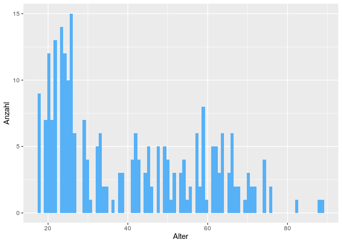<!-- -->

```r
# TODO Farben Balkendiagramm Erstell einen Boxplot
boxplot(alter, horizontal = TRUE, col = "#56B1F7")
```

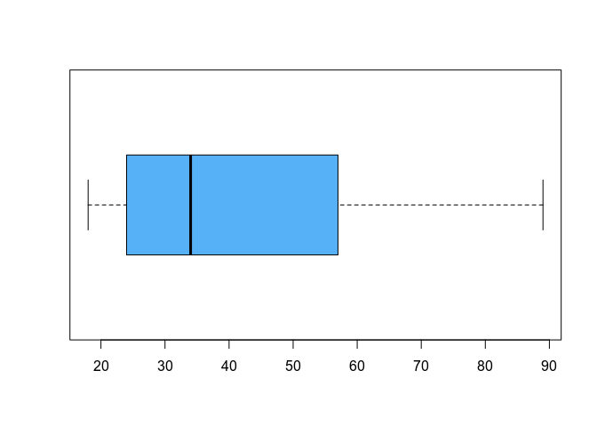<!-- -->
    
Wie das erhaltene Balkendiagramm zeigt, folgt die Variable "Alter" einer rechts-schiefen Verteilung: Ein hoher Anteil der Studienteilnehmer ist zum Zeitpunkt der Erhebung zwischen 18 und 30 Jahren alt gewesen. Der Median der Verteilung liegt bei einem Alter von 34 Jahren, der Mittelwert bei (gerundet) 40 Jahren mit einer Standardabweichung von etwa 18 Jahren. Aus dem Boxplot ist ersichtlich, dass fünfzig Prozent der Befragten zwischen 24 und 57 Jahren alt sind. Das allgemeine Durchschnittsalter der deutschen Bevölkerung lag im Befragungsjahr 2013 bei 44,2 Jahren [@destatis_bevolkerungsstand_2011]. Ungeachtet der weiteren Auswahlmethoden zur Wahrung der Repräsentativität dieser Studie weisst die Nähe des durchschnittlichen Alters der Teilnehmenden zum durchschnittlichen Alter der Gesamtbevölkerung auf eine mögliche Repräsentativität hin.

## Geschlecht und Einkommen

Bei der Geschlechterverteilung der Probanden teilt sich die Gruppe der Befragten in zwei, fast gleich große Lager auf:

```
##           summary(geschlecht)
## maennlich                 130
## weiblich                  127
```

Es haben lediglich drei Männer mehr als Frauen an der Studie teilgenommen – in den Umfragedaten herrscht also ein sehr ausgeglichenes Geschlechterverhältnis.

Anders verhält es sich jedoch bei der Verteilung der jeweiligen Einkommen und des Bildungsstandes, hier sind deutliche Ungleichgewichte zu erkennen. Beginnen wir mit Analyse der Einkommenssituation:


```r
# Bilde eine Tabelle
einkommen_table <- select(tv13a, a43, a46)
# Reduziere das Set mit tally() und zähle die jeweiligen Ausprägungen
einkommen_gruppiert <- einkommen_table %>% group_by(a43, a46) %>% tally()

# Kürze die Namen der Bildungsarten, damit diese in die Grafik passen
einkommen_gruppiert$a46 <- revalue(einkommen_gruppiert$a46, c(`aus anderen Gruenden nicht berufstaetig` = "Andere Gründe", 
    `geringfuegig bzw in einem Minijob beschaeftigt` = "geringfügig beschäftigt", 
    `in Rente, Pension oder Vorruhestand` = "Pensioniert"))
```

Nachdem wir nun einen sortierten Datenframe mit den nach Geschlechtern gruppierten Einkommensarten generiert haben, erstellen wir hierzu eine Übersichtsgrafik:


```r
# Geniere eine Grafik mit ggplot
ggplot(data = einkommen_gruppiert, aes(a46, n, fill = a43)) + geom_col(position = "dodge") + 
    geom_text(data = einkommen_gruppiert, aes(label = n, hjust = -0.5), size = 3, 
        position = position_dodge(width = 0.9)) + labs(x = "Einkommensart", y = "Anzahl") + 
    theme(legend.position = "bottom", legend.title = element_blank()) + coord_flip()
```

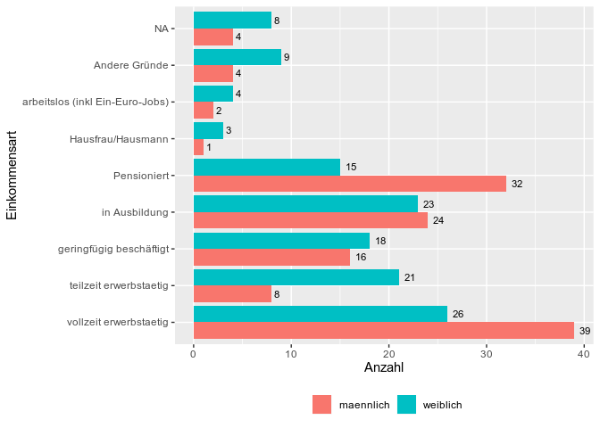<!-- -->


Hier ist ersichtlich, dass ein klares Ungleichgewicht bei der Beschäftigungsart herrscht: 39 der befragten Männer geben an, Vollzeit erwerbstätig zu sein während nur 26 Frauen dasselbe angeben. Dafür überwiegen diese in der Gruppe der Teilzeit erwerbstätigen mit 21 zu 8 Männern. Auch die Zahl der pensionierten Männer ist fast doppelt so hoch wie der Anteil der Rentnerinnen.

Auffällig ist zudem die sehr geringe Zahl der Ausprägung des Berufs *Hausmann/Frau* und die doppelt so hohe Angabe der befragten Frauen von keiner Erwerbslosigkeit oder das komplette Nicht-Ausfüllen der Frage. Mögliche Interpretationen für diese hohe Ausprägung auf Seite der Frauen wären etwa die mögliche Scham sich als *Hausfrau* zu identifizieren oder das die befragten Frauen bei der Angabe ihrer Einkommensart im Allgemeinen verschlossener sind.


## Bildungsniveau

Beim Betrachten der jeweils höchsten Bildungsabschlüsse der Probanden ist ein solches Ungleichgewicht wie bei den Einkommensarten nicht festzustellen. Die Anzahl der Personen mit einem vergleichbaren Bildungsabschluss unterscheidet sich in der Befragung kaum zwischen den beiden Geschlechtern. 

<!-- -->

Vorsichtig interpretiert könnte also angenommen werden, dass sich in der Auswahlgesamtheit der Studie nicht unbedingt von einem höheren Bildungsabschluss auf einen höheren Anteil an Vollbeschäftigung schließen lässt. Im Allgemeinen weisen die Studienteilnehmer ein relativ hohes formales Bildungsniveau auf, da

```
## [1] 57.97665
```
Prozent der befragten Abitur oder einen vergleichbaren Bildungsabschluss erlangt haben.

## Parteipräferenz

Besonders interessant im Hinblick auf das TV-Duell sind die Parteipräferenzen der Probanden, insbesondere die der Sympathisanten der Parteien von Frau Merkel oder Herrn Steinbrück. Damit die Variable grafisch ansprechend aufbereitet werden kann, müssen zunächst einige Umformungen unternommen werden:


```r
# Wähle Version A der Parteipräferenz, damit einmalig genannte Parteien als
# 'andere Partei' zusammengefasst werden
parteipräferenz <- select(tv13a, a54a, a44)
# Übersicht Parteinennungen (bei Bedarf) summary(parteipräferenz$a54a) Lösche
# ungenannte Parteien aus dem dataframe
parteipräferenz <- droplevels(parteipräferenz)
# Kürze die Labels, damit alles in die Grafik passt
parteipräferenz$a54a <- revalue(parteipräferenz$a54a, c(`andere Partei` = "Andere", 
    `keine Partei` = "Keine"))
# Zähle die allgemeinen Parteinennungen
parteipräferenz_gruppiert <- parteipräferenz %>% group_by(a54a) %>% tally()

# Definiere die Parteifarben für die Grafik
parteifarben <- c("#000000", "#E3000F", "#EFC900", "#078C41", "#D9048E", "#D94D00", 
    "#36C8D9", "#7D7A7A", "#597D6E", "#7D7A7A")
# Errechne die prozentuale Nennung der Parteien
parteiprozente <- paste(as.character(round(parteipräferenz_gruppiert$n/nrow(parteipräferenz) * 
    100, digits = 1)), "%")
# Erstelle ein Balkendiagramm Parteipräferenz der Befragten
ggplot(data = parteipräferenz_gruppiert, aes(a54a, n, fill = parteifarben)) + geom_col() + 
    scale_fill_identity() + geom_text(data = parteipräferenz_gruppiert, aes(label = parteiprozente, 
    vjust = -0.5), size = 3, position = position_dodge(width = 0.9)) + labs(x = "Neigen Sie ganz allgemein einer bestimmten Partei zu?", 
    y = "Zahl der Angaben")
```

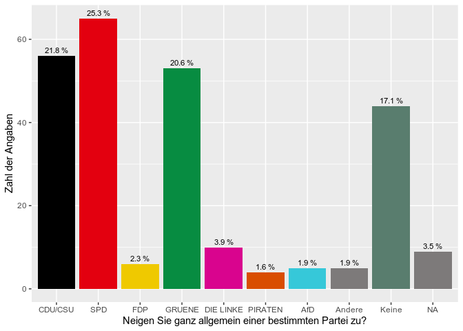<!-- -->

Der Großteil der Studienteilnehmer ist demnach eher der *SPD* als der *CDU* zugeneigt, auch wenn der Unterschied zwischen den beiden Lagern nur 9 Probanden beträgt. Überraschend hoch und anders als in der Grundgesamtheit ist die Zahl der Grün-Wähler mit 20,6 % oder 53 Befragten. Die Rolle der zweitstärksten Fraktion geht wieder erwarten jedoch nicht an die CDU/CSU – die gemeinsame Gruppe aus Probanden die angeben, keine Partei zu bevorzugen und jenen, welche die Frage erst gar nicht beantwortet haben ist mit 20,6 % oder 53 Probanden erstaunlich hoch.

Hält sich dieser Eindruck auch, wenn der Faktor des Alters mit den Parteipräferenzen in Verbindung gebracht wird?

### Parteipräferenz nach Alter

Ältere Menschen neigen häufig zu konservativeren Parteien als Junge [@Goerres_2010]. Hierfür gibt es in der Wissenschaft verschiedene Erklärungsansätze, wie etwa Traditionsverbundenheit und Angst vor Veränderung. Wenn die allgemeine Bevölkerung, je älter sie wird, also desto stärker zu konservativen Parteien wie der *CDU/CSU* neigt, müsste sich dies auch in den Umfragedaten widerspiegeln:


```r
partei_altersgruppen <- parteipräferenz
# Erstelle neue Spalte Altersgruppe
partei_altersgruppen$altersgruppe <- partei_altersgruppen$a44
# Gruppiere den Altersfaktor in Altersgruppen
levels(partei_altersgruppen$altersgruppe) <- list(`18-29` = 18:29, `30-49` = 30:49, 
    `50-65` = 50:65, `66-89` = 66:89)
# Zähle die Parteinennungen sortiert nach den Altersgruppen
partei_altersverlauf <- partei_altersgruppen %>% group_by(altersgruppe, a54a) %>% 
    tally()
# Behalte nur die CDU, da die Zahl der AfD sich nur um einen Wähler verringert
partei_alter_konservative <- filter(partei_altersverlauf, a54a %in% "CDU/CSU") %>% 
    select(altersgruppe, n)
partei_alter_unkonservative <- filter(partei_altersverlauf, a54a %in% c("SPD", "FDP", 
    "GRUENE", "PIRATEN", "DIE LINKE"))

# Erstelle Histogram beider Verläufe
grafik_kons <- ggplot(partei_alter_konservative, aes(x = altersgruppe, y = n, fill = "CDU")) + 
    geom_col(fill = "#000000") + scale_fill_identity() + geom_text(data = partei_alter_konservative, 
    aes(label = n, vjust = -0.5), size = 3, position = position_dodge(width = 0.9)) + 
    labs(x = "Altersverteilung CDU", y = "Zahl der Angaben")

# Unkonservativ
parteifarben2 <- parteifarben[2:6]
grafik_unkons <- ggplot(partei_alter_unkonservative, aes(x = altersgruppe, y = n, 
    fill = a54a)) + geom_col(position = "dodge") + geom_text(data = partei_alter_unkonservative, 
    aes(label = n, vjust = -0.5), size = 3, position = position_dodge(width = 0.9)) + 
    labs(x = "Altersverteilung der unkonservativen Parteien", y = "Zahl der Angaben")

# scale_fill_identity() + geom_text(data=parteipräferenz_gruppiert,
# aes(label=parteiprozente,vjust=-0.5), size = 3, position = position_dodge(width
# = 0.9)) + labs(x='Frage 53: Neigen Sie – ganz allgemein – einer bestimmten
# Partei zu?', y='Zahl der Angaben')

multiplot(grafik_kons, grafik_unkons, cols = 2)
```

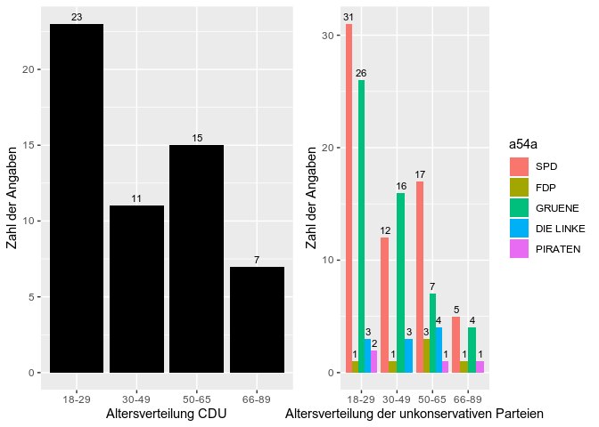<!-- -->

In unserem Datensatz kann diese These der stärkeren Neigung Älterer zu konservativen Parteien demnach verneint werden. Zumindest gibt es bei den beiden großen Volksparteien *CDU/CSU* und *SPD* keinen signifikanten Unterschied im Verlauf der Parteipräferenz. Für beide ist auffällig, das es nach einem starken Abfall der Präferenz in der Gruppe der 30 bis 49-Jährigen in der nächst höheren Altersgruppe wieder bergauf geht. Das die beiden Volksparteien in der höchsten Altersgruppe keine Spitzenwerte erreichen mag also vielleicht der vergleichsweise geringen Anzahl von Teilnehmern dieser Altersgruppe geschuldet sein.

### Politisches Interesse nach Alter

Das sich der ältere Teil der Befragten jedoch generell nicht für Politik interessiert kann anhand der Daten widerlegt werden. Vor allem der jüngere Teil der Befragten gibt an, weniger stark an Politik interessiert zu sein:

```r
# Politisches Interesse allgemein
summary(tv13a$a1)
```

```
##       sehr stark            stark    mittelmaessig    weniger Stark 
##               66               94               77               18 
## ueberhaupt nicht 
##                2
```

```r
# Boxplot Politisches Interesse / Alter
ggplot(tv13a, aes(y = alter, x = tv13a$a1)) + geom_boxplot() + labs(x = "Politisches Interesse", 
    y = "Alter")
```

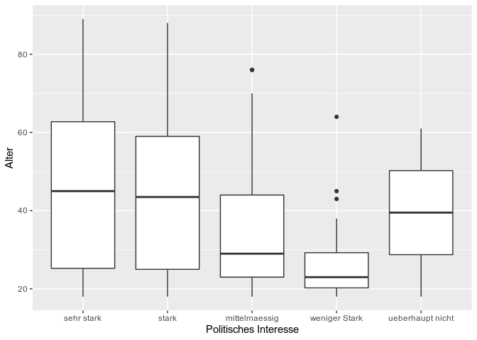<!-- -->

Die Antwortmöglichkeiten *stark* und *sehr stark* sind beinahe deckungsgleich in der Verteilung, lediglich das 75 %-Quartil der Ausprägung *stark* liegt einige Jahre unter dem entsprechenden Quartil der Ausprägung *sehr stark*.
Deutlich ist jedoch vor allem die Geringe Alters-Streuung jener, die angeben *weniger stark* interessiert zu sein – die mittleren 50 % sind klar zwischen 20 und 30 Jahren alt.

# Einfluss des TV-Duells 2013 auf die Studienteilnehmer

Nachdem die Variablen der Rahmenbedingungen der GESIS-Studie nunmehr eingehend beleuchtet worden sind, soll in diesem Abschnitt der Einfluss des tatsächlichen TV-Duells auf die Einstellungen der Befragten getestet werden. Den Anfang macht bei diesem Unterfangen die Variable der *Wahlabsicht* – beeinflusst das Duell die Entscheidung der Zuschauer an der Wahl teilzunehmen?
  
## Einfluss auf die Absicht wählen zu gehen
  
Um die Wahlabsicht messen zu können müssen zunächst die Werte vor und nach dem Duell in einem Datenframe zusammengefasst werden:
  

```r
wahlabsicht <- data.frame(as.character(tv13a$a3), as.character(tv13b$b3), stringsAsFactors = FALSE)
colnames(wahlabsicht) <- c("Vorher", "Nachher")
```
  
Die Unterschiede dieser beiden Variablen scheinen ziemlich gering zu sein, weshalb wir uns nur die Unterschiede in einer neuen Zeile zusammenfassen lassen:  
    

```r
# Fasse die Unterschiede in einer neuen Zeile zusammen
wahlabsicht$Unterschied <- !wahlabsicht$Nachher %in% wahlabsicht$Vorher
# Wo ist der Unterschied?
wahlabsicht[wahlabsicht['Unterschied'] == TRUE]
```

```
## [1] "bestimmt zur Wahl gehen" NA                       
## [3] "TRUE"
```
  
Durch das Treatment des TV-Duells hat sich nur eine einzige Ausprägung, von *gehe bestimmt zur Wahl* zu *NA* geändert – entweder der entsprechende Teilnehmer ist durch das Duell so verunsichert worden, dass er gar nichts mehr ankreuzen wollte oder aber er hat die Frage schlicht übersprungen oder übersehen.

Das TV-Duell hat als praktisch gar keinen Einfluss auf die Absicht zur Wahl zu gehen. Ob dies bei der Sicherheit der Wahl*entscheidung* anders aussieht?
  
## Einfluss auf die Sicherheit der Wahlentscheidung
  
Die ordinale Variable *a5* beziehungsweise *b5* gibt mit 4 Ausprägungen an, wie sicher sich ein Proband bei der Entscheidung für seine Stimmwahl bei der Bundestagswahl 2013 gefühlt hat. Um herauszufinden, ob und wie viel das Treatment TV-Duell in dieser Sicherheit geändert hat, Berechnen wir erst einmal die gruppierten Ausprägungen der Variablen:


```r
# Erstelle einen Frame
wahlentscheidung <- data.frame(tv13a$a5, tv13b$b5, stringsAsFactors = TRUE)
# Benenne die Spalten
colnames(wahlentscheidung) <- c("Vorher", "Nachher")
# Gruppiere und zähle die Ausprägungen
wahlentscheidung_diff <- wahlentscheidung %>% group_by(Vorher, Nachher) %>% tally()
```

Bei näherer Betrachtung der Daten fallen enorme Unterschiede zwischen den Werten *Vorher* und *Nachher* auf, allein die Zahl der Probanden die sicher vorher nur *sicher* und nach dem Duell *sehr sicher* in ihrer Wahlentscheidung waren, beträgt 18.
  
### Sankey-Diagramm

Mithilfe eines Sankey-Diagrammes können die jeweiligen Wanderungen zwischen den Werten gut nachvollzogen werden:


```r
# Erstelle ein Sankey-Diagramm
#install.packages("networkD3")
require(networkD3)

# Konvertiere die Spalte 'Vorher' in das passende Format (Werte 0-4 für Variablen)

wahlentscheidung_diff$Vorher <- factor(wahlentscheidung_diff$Vorher,
                                       levels = c(levels(
                                         wahlentscheidung_diff$Vorher),
                                         4))

levels(wahlentscheidung_diff$Vorher) <- list(
  "0"="sehr sicher", "1"="sicher",
  "2"="nicht so sicher", "3"="ueberhaupt nicht sicher",
  "4"="NA")
  
# Konvertiere alle NA's zu einer 4
wahlentscheidung_diff$Vorher[is.na(wahlentscheidung_diff$Vorher)] <- 4

# Mache das gleiche für die Spalte 'Nachher', beginne bei Wert '5'
wahlentscheidung_diff$Nachher <- factor(wahlentscheidung_diff$Nachher,
                                        levels = c(levels(
                                          wahlentscheidung_diff$Nachher),
                                          4))

levels(wahlentscheidung_diff$Nachher) <- list(
  "5"="sehr sicher", "6"="sicher",
  "7"="nicht so sicher", "8"="ueberhaupt nicht sicher",
  "9"="NA")
  
# Konvertiere alle NA's zu einer 4
wahlentscheidung_diff$Nachher[is.na(wahlentscheidung_diff$Nachher)] <- 9

# Lege die Nodes für das Sankey-Diagramm an
nodes <- data.frame("Sicherheit" = 
 c("sehr sicher", # Node 0
 "sicher", # Node 1
 "nicht so sicher", # Node 2
 "ueberhaupt nicht sicher", # Node 3
 "NA", # Node 4
 # Definiere die Zielvariablen
 "sehr sicher", # Node 5
 "sicher", # Node 6
 "nicht so sicher", # Node 7
 "ueberhaupt nicht sicher", # Node 8
 "NA" # Node 9
 )) 

links <- as.data.frame(wahlentscheidung_diff)

# Konvertiere die Faktoren zu numerischen Werten
links$Vorher <- as.numeric.factor(wahlentscheidung_diff$Vorher)
links$Nachher <- as.numeric.factor(wahlentscheidung_diff$Nachher)
links$n <- as.numeric(wahlentscheidung_diff$n)


sankey <- sankeyNetwork(Links = links, Nodes = nodes,
 Source = "Vorher", Target = "Nachher",
 Value = "n", NodeID = "Sicherheit", units = "Teilnehmer", 
 fontSize= 15, nodeWidth = 10, iterations=2, sinksRight = TRUE)

htmlwidgets::prependContent(sankey, htmltools::tags$h3("Sicherheit der Wahlentscheidung vor und nach dem TV-Duell"))
```

<!--html_preserve--><h3>Sicherheit der Wahlentscheidung vor und nach dem TV-Duell</h3>
<div id="htmlwidget-febfc4b0f3cad6eb2e3d" style="width:672px;height:480px;" class="sankeyNetwork html-widget"></div>
<script type="application/json" data-for="htmlwidget-febfc4b0f3cad6eb2e3d">{"x":{"links":{"source":[0,0,0,1,1,1,1,2,2,2,2,3,4,4,4,4,4],"target":[5,6,9,5,6,7,9,5,6,7,9,7,5,6,7,8,9],"value":[54,9,5,18,45,6,10,3,8,5,2,1,4,13,8,1,65]},"nodes":{"name":["sehr sicher","sicher","nicht so sicher","ueberhaupt nicht sicher","NA","sehr sicher","sicher","nicht so sicher","ueberhaupt nicht sicher","NA"],"group":["sehr sicher","sicher","nicht so sicher","ueberhaupt nicht sicher","NA","sehr sicher","sicher","nicht so sicher","ueberhaupt nicht sicher","NA"]},"options":{"NodeID":"Sicherheit","NodeGroup":"Sicherheit","LinkGroup":null,"colourScale":"d3.scaleOrdinal(d3.schemeCategory20);","fontSize":15,"fontFamily":null,"nodeWidth":10,"nodePadding":10,"units":"Teilnehmer","margin":{"top":null,"right":null,"bottom":null,"left":null},"iterations":2,"sinksRight":true}},"evals":[],"jsHooks":[]}</script><!--/html_preserve-->

```r
# Achtung: Im PDF dieses Dokumentes wird mittels der 'webshot'-library ein 
# statisches Bild des Sankey-Diagramms erstellt. Die Werte der einzelnen 
# Wanderungen sind aber nur im HTML Dokument interaktiv einsehbar.
```
  
Das Sankey-Diagramm zeigt viele verborgene Details: So sind etwa 3 Teilnehmer vor dem Duell *nicht so sicher* in ihrer Wahlabsicht, nach dem Duell aber *sehr sicher*. Auch von der mit 91 Probanden größte Gruppe, die vor dem Duell keine Angabe über ihre Wahlsicherheit gemacht haben, sind insgesamt 17 nach dem Duell *sicher* oder sogar *sehr sicher* in ihrer Wahlentscheidung.

Die Grafik in Verbindung mit den vorliegenden Daten zeigt, dass eine deutliche Verschiebung in der Sicherheit der vorraussichtlichen Wahlentscheidung durch das Treatment des TV-Duells ausgelöst wurde. Die Hypothese (1) für diese Arbeit, nach welcher ein deutlich messbarer Effekt des TV-Duells auf die Sicherheit der Wahlentscheidung der Zuschauer besteht, kann somit angenommen werden.
  
# Einfluss des TV-Duells auf die Wahrnehmung der Kandidaten 
  
Wie im bisherigen Verlauf dieser Untersuchung bereits festgestellt werden konnte, ist er Einfluss des TV-Duells auf die Absicht überhaupt zur Wahl zu gehen verschwindend gering – der Einfluss auf die Sicherheit der Wahlentscheidung ist hingegen enorm.
  
Einige der Gründe für diese Verschiebung in der Stimmwahlsicherheit liegen im Auftreten und den Argumenten der beiden Kanzlerkandidaten: Durch die subjektive Wahrnehmung der positiven und negativen Äußerungen und Eigenschaften dieser werden die Probanden bewusst und unbewusst in ihrer vorab getroffenen Wahlabsicht bestätigt oder verunsichert. Vor allem die Charaktereigenschaften, welche den beiden Spitzenkandidaten zugeschrieben werden scheinen dabei sehr aufschlussreich für das allgemeine öffentliche Bild des Kandidaten im Allgemeinen und die öffentliche Rezeption im Speziellen.

Im GESIS-Fragebogen wurde vor und nach dem TV-Duell über die frei-textliche Nennung von positiven und negativen Eigenschaften der jeweiligen Kandidaten gebeten. Diese offenen Nennungen sollen im Folgenden gesammelt, gesäubert, aufbereitet und verglichen werden:


```r
# Wähle die Variablen der beiden Wellen aus
EGSa <- select(tv13a, 
       a32as, # positive Eigenschaften Merkel
       a32bs, # negative Eigenschaften Merkel
      A32BS0, # negative Eigenschaften Merkel - Zusatzzeile
       a33as, # Gute Eigenschaften Steinbrueck 
       a33bs, # Schlechte Eigenschaften Steinbrueck 
      A33BS0 # Schlechte Eigenschaften Steinbrueck - Zusatzzeile
      )
# Fasse die jeweiligen Zusatzzeilen zusammen
EGSa$A32BS1 <- paste(EGSa$a32bs,EGSa$A32BS0)
EGSa$A33BS1 <- paste(EGSa$a33bs,EGSa$A33BS0)

# Mache das Ganze für Welle B
EGSb <- select(tv13b,
       b32as, # positive Eigenschaften Merkel
       B32AS0, # positive Eigenschaften Merkel - Zusatzzeile
       b32bs, # negative Eigenschaften Merkel
      B32BS0, # negative Eigenschaften Merkel - Zusatzzeile
       b33as, # Gute Eigenschaften Steinbrueck 
       b33bs # Schlechte Eigenschaften Steinbrueck 
         
  )
# Zusatzzeilen zusammenfassen
EGSb$B32AS1 <- paste(EGSb$b32as,EGSa$B32AS0)
EGSb$B32BS1 <- paste(EGSb$b32bs,EGSa$B32BS0)

# Wurden die rausgerechneten NAs von oben übernommen?
nrow(EGSa) == 257 # Zahl der bereinigten Fälle, Unbereinigt N = 268 
```

```
## [1] TRUE
```

```r
nrow(EGSb) == 257 # Zahl der bereinigten Fälle, Unbereinigt N = 268 
```

```
## [1] TRUE
```
  

## Eigenschaften von Angela Merkel
  
Nach erfolgter Auswahl der Datengrundlage widmen wir uns zuerst den positiven und negativen Eigenschaften von Angela Merkel:
    

```r
# Positive Eigenschaften Merkel - Welle 1

# Los gehts! Konvertieren wir erst mal alles zu Kleinbuchstaben. tolower macht
# automatische eine matrix, wir wollen aber den data frame und character vecetor
# behalten - stringsasFactors deshalb verneinen
EGSa <- as.data.frame(apply(EGSa, 2, tolower), stringsAsFactors = FALSE)

# Zerteile die Reihen in einzelne Wörter, nicht unlist vergessen! strsplit
# braucht einen character-vektor
EGSa_test_m_pos <- unlist(strsplit(EGSa$a32as, "\\s|[;]|[,]|[.]|[=]|[(]|[)]|[!]|[-]|[>]|[<]"))
# Lösche die Leeren Stellen des Vektors
EGSa_test_m_pos <- EGSa_test_m_pos[nchar(EGSa_test_m_pos) > 0]


# stopwörter definieren
stopwords_tm <- stopwords(kind = "german")
# Eigene Stopwords
stopwords_EGS <- c("-99", ";", "-", "wirkt", "und", "sie", "es", "für", "gibt", 
    "hat", "mit", "in", "der", "hält", "bzw", stopwords_tm)

# Stopwörter rausrechnen
EGSa_test_m_pos <- EGSa_test_m_pos[!EGSa_test_m_pos %in% stopwords_EGS]

# Nach absteigender Häufigkeit sortieren
EGSa_orderd <- EGSa_test_m_pos[order(EGSa_test_m_pos, decreasing = TRUE)]

# Matrix erstellen und nach absteigender Häufigkeit sortieren
EGSa_freq <- sort(termFreq(EGSa_orderd), decreasing = TRUE)

EGSa_matrix <- as.data.frame(EGSa_freq)

EGSa_M_positiv_fin <- data.frame(row.names(EGSa_matrix), EGSa_matrix$EGSa_freq, row.names = row.names(EGSa_matrix))
colnames(EGSa_M_positiv_fin) <- c("word", "freq")

wc1 <- wordcloud2(EGSa_M_positiv_fin, color = "lightblue", rotateRatio = 0.2, gridSize = 2)
head1 <- head(EGSa_M_positiv_fin, 10)
```
   
Genau dasselbe wird jetzt im Hintergrund für alle Kandidaten beider Wellen für die positiven und negativen Werte durchgeführt und die entsprechenden Werte und Wortwolken danach ausgegeben.
   


  
### Positive Eigenschaften


Angaben über positive Eigenschaften von Angela Merkel vor dem TV-Duell:

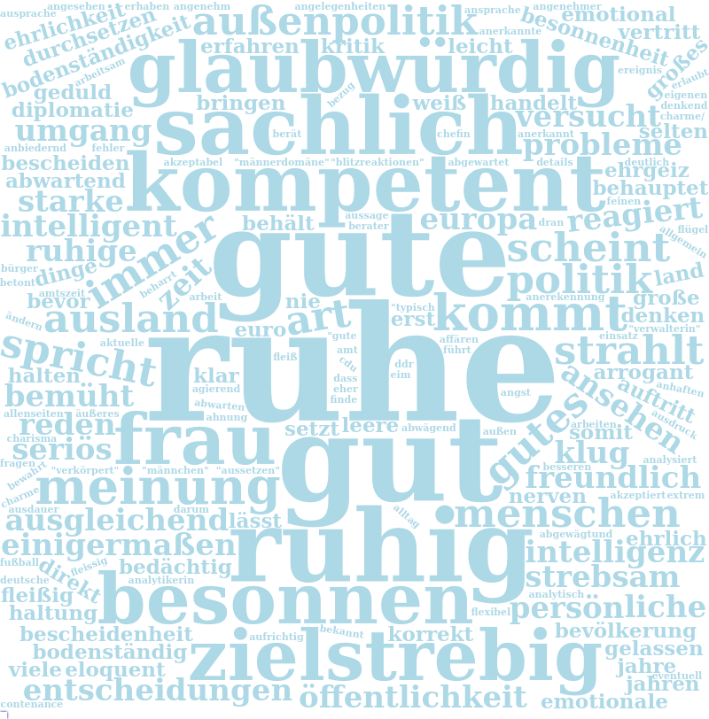

Angaben nach dem TV-Duell:
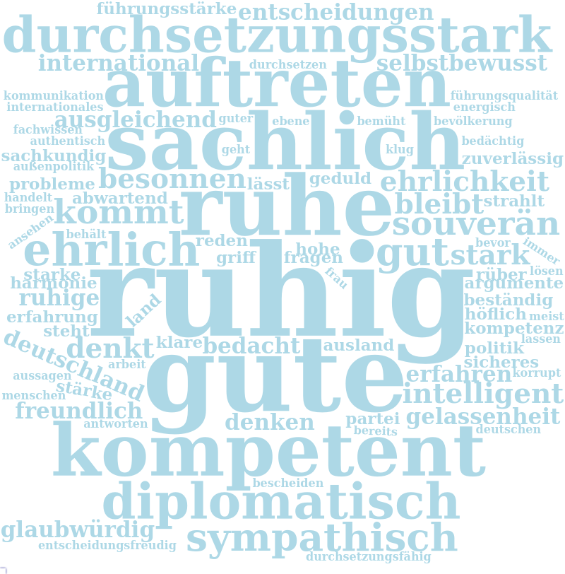
Tabelle der häufigsten Äußerungen:


```r
kable(data.frame(head1, head3, check.names = FALSE, row.names = NULL), caption = "Angaben über positive Eigenschaften von Angela Merkel") %>% kable_styling(bootstrap_options = c("striped", "hover", "condensed")) %>% 
  add_header_above(header = c("Vor dem TV-Duell" = 2, "Nach dem TV-Duell" =2))
```

<table class="table table-striped table-hover table-condensed" style="margin-left: auto; margin-right: auto;">
<caption>Angaben über positive Eigenschaften von Angela Merkel</caption>
 <thead>
<tr>
<th style="border-bottom:hidden; padding-bottom:0; padding-left:3px;padding-right:3px;text-align: center; " colspan="2"><div style="border-bottom: 1px solid #ddd; padding-bottom: 5px; ">Vor dem TV-Duell</div></th>
<th style="border-bottom:hidden; padding-bottom:0; padding-left:3px;padding-right:3px;text-align: center; " colspan="2"><div style="border-bottom: 1px solid #ddd; padding-bottom: 5px; ">Nach dem TV-Duell</div></th>
</tr>
  <tr>
   <th style="text-align:left;"> word </th>
   <th style="text-align:right;"> freq </th>
   <th style="text-align:left;"> word </th>
   <th style="text-align:right;"> freq </th>
  </tr>
 </thead>
<tbody>
  <tr>
   <td style="text-align:left;"> auftreten </td>
   <td style="text-align:right;"> 16 </td>
   <td style="text-align:left;"> ruhig </td>
   <td style="text-align:right;"> 23 </td>
  </tr>
  <tr>
   <td style="text-align:left;"> ruhe </td>
   <td style="text-align:right;"> 16 </td>
   <td style="text-align:left;"> gute </td>
   <td style="text-align:right;"> 19 </td>
  </tr>
  <tr>
   <td style="text-align:left;"> diplomatisch </td>
   <td style="text-align:right;"> 15 </td>
   <td style="text-align:left;"> ruhe </td>
   <td style="text-align:right;"> 15 </td>
  </tr>
  <tr>
   <td style="text-align:left;"> gut </td>
   <td style="text-align:right;"> 12 </td>
   <td style="text-align:left;"> sachlich </td>
   <td style="text-align:right;"> 14 </td>
  </tr>
  <tr>
   <td style="text-align:left;"> gute </td>
   <td style="text-align:right;"> 12 </td>
   <td style="text-align:left;"> kompetent </td>
   <td style="text-align:right;"> 13 </td>
  </tr>
  <tr>
   <td style="text-align:left;"> ruhig </td>
   <td style="text-align:right;"> 10 </td>
   <td style="text-align:left;"> auftreten </td>
   <td style="text-align:right;"> 12 </td>
  </tr>
  <tr>
   <td style="text-align:left;"> durchsetzungsvermögen </td>
   <td style="text-align:right;"> 9 </td>
   <td style="text-align:left;"> diplomatisch </td>
   <td style="text-align:right;"> 9 </td>
  </tr>
  <tr>
   <td style="text-align:left;"> kompetent </td>
   <td style="text-align:right;"> 8 </td>
   <td style="text-align:left;"> durchsetzungsstark </td>
   <td style="text-align:right;"> 9 </td>
  </tr>
  <tr>
   <td style="text-align:left;"> sachlich </td>
   <td style="text-align:right;"> 8 </td>
   <td style="text-align:left;"> durchsetzungsvermögen </td>
   <td style="text-align:right;"> 9 </td>
  </tr>
  <tr>
   <td style="text-align:left;"> besonnen </td>
   <td style="text-align:right;"> 7 </td>
   <td style="text-align:left;"> ehrlich </td>
   <td style="text-align:right;"> 8 </td>
  </tr>
</tbody>
</table>
  
Beim Vergleich der beiden Wortwolken über die positiven Eigenschaften von Frau Merkel vor und nach dem TV-Duell fällt zunächst ihre Charakterisierung als _ruhig_ ins Auge: Während diese Eigenschaft und ihre Synonyme vor dem Duell noch 26 Nennungen aufwies, stieg diese nach dem Duell auf 38 Nennungen an. Das Verhalten der Spitzenkandidatin in der Livesituation hat also ihren als ruhig wirkenden Eindruck bei den Probanden noch deutlich verstärkt. Klar abgenommen hat jedoch die Nennung der Eigenschaft _diplomatisch_ von zuvor 15 auf nunmehr 9 Nennungen. Eine mögliche Erklärung hierfür ist der Widerspruch zwischen dem ansonsten sehr staatsfraulichen Auftretens von Frau Merkel und der direkten Konfrontation im Duell. Klar hinzugewonnen haben ebenfalls die positiven Eigenschaften _sachlich_ und _kompetent_. Neu hinzugekommen die Reihe der Zehn häufigst genannten Eigenschaften ist die Eigenschaft _ehrlich_ – auch dieses Zuschreiben könnte in ihrem Auftritt im Duell begründet sein.

### Negative Eigenschaften

Angaben über negative Eigenschaften von Angela Merkel vor dem TV-Duell:
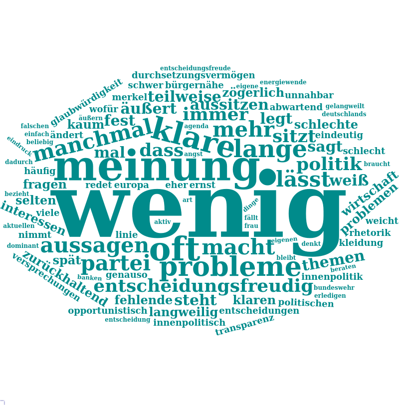
Angaben nach dem TV-Duell:

Tabelle der häufigsten Äußerungen:


```r
kable(data.frame(head2, head4, check.names = FALSE, row.names = NULL), caption = "Angaben über negative Eigenschaften von Angela Merkel") %>% kable_styling(bootstrap_options = c("striped", "hover", "condensed")) %>% 
  add_header_above(header = c("Vor dem TV-Duell" = 2, "Nach dem TV-Duell" =2))
```

<table class="table table-striped table-hover table-condensed" style="margin-left: auto; margin-right: auto;">
<caption>Angaben über negative Eigenschaften von Angela Merkel</caption>
 <thead>
<tr>
<th style="border-bottom:hidden; padding-bottom:0; padding-left:3px;padding-right:3px;text-align: center; " colspan="2"><div style="border-bottom: 1px solid #ddd; padding-bottom: 5px; ">Vor dem TV-Duell</div></th>
<th style="border-bottom:hidden; padding-bottom:0; padding-left:3px;padding-right:3px;text-align: center; " colspan="2"><div style="border-bottom: 1px solid #ddd; padding-bottom: 5px; ">Nach dem TV-Duell</div></th>
</tr>
  <tr>
   <th style="text-align:left;"> word </th>
   <th style="text-align:right;"> freq </th>
   <th style="text-align:left;"> word </th>
   <th style="text-align:right;"> freq </th>
  </tr>
 </thead>
<tbody>
  <tr>
   <td style="text-align:left;"> wenig </td>
   <td style="text-align:right;"> 30 </td>
   <td style="text-align:left;"> wenig </td>
   <td style="text-align:right;"> 24 </td>
  </tr>
  <tr>
   <td style="text-align:left;"> meinung </td>
   <td style="text-align:right;"> 14 </td>
   <td style="text-align:left;"> lässt </td>
   <td style="text-align:right;"> 10 </td>
  </tr>
  <tr>
   <td style="text-align:left;"> oft </td>
   <td style="text-align:right;"> 11 </td>
   <td style="text-align:left;"> entscheidungen </td>
   <td style="text-align:right;"> 8 </td>
  </tr>
  <tr>
   <td style="text-align:left;"> klare </td>
   <td style="text-align:right;"> 10 </td>
   <td style="text-align:left;"> manchmal </td>
   <td style="text-align:right;"> 8 </td>
  </tr>
  <tr>
   <td style="text-align:left;"> probleme </td>
   <td style="text-align:right;"> 9 </td>
   <td style="text-align:left;"> aussagen </td>
   <td style="text-align:right;"> 7 </td>
  </tr>
  <tr>
   <td style="text-align:left;"> lange </td>
   <td style="text-align:right;"> 8 </td>
   <td style="text-align:left;"> mehr </td>
   <td style="text-align:right;"> 7 </td>
  </tr>
  <tr>
   <td style="text-align:left;"> aussagen </td>
   <td style="text-align:right;"> 7 </td>
   <td style="text-align:left;"> oft </td>
   <td style="text-align:right;"> 7 </td>
  </tr>
  <tr>
   <td style="text-align:left;"> lässt </td>
   <td style="text-align:right;"> 7 </td>
   <td style="text-align:left;"> probleme </td>
   <td style="text-align:right;"> 7 </td>
  </tr>
  <tr>
   <td style="text-align:left;"> macht </td>
   <td style="text-align:right;"> 7 </td>
   <td style="text-align:left;"> zögerlich </td>
   <td style="text-align:right;"> 7 </td>
  </tr>
  <tr>
   <td style="text-align:left;"> manchmal </td>
   <td style="text-align:right;"> 7 </td>
   <td style="text-align:left;"> aussitzen </td>
   <td style="text-align:right;"> 6 </td>
  </tr>
</tbody>
</table>
Weitaus weniger linear verhält es sich mit der Nennung der negativen Eigenschaften von Frau Merkel vor und nach dem Schlagabtausch im Fernsehen. Die am häufigsten genannten Eigenschaften wie _manchmal_, _probleme_ und _aussagen_ bleiben auf fast demselben Niveau. Die Ausnahme bildet hier die am häufigste genannte Eigenschaft _wenig_, die um 6 Nennungen abfällt. Eine mögliche Erklärung für das allgemein hohe Aufkommen des Wortes ist die verstärkende Funktion dieses adjektives, mit der andere Eigenschaften oft verstärkt werden. 
  
Neu in der Tabelle sind nach dem Duell die Nennungen _probleme_ mit 7 Nennungen, _entscheidungen_ mit 8 Nennungen, _zögerlich_ mit 7 Nennungen und _lässt_ mit ganzen 10 Nennungen. Vor allem die Häufigkeit dieses letzten Passiv-Wortes lässt den Schluss zu, dass die Studienteilnehmer Frau Merkel oft in einer passiven, aber auch offenen Rolle im Duell wahrgenommen. Auch durch das Wort *lässt* lassen sich andere Eigenschaften verstärken (beispielsweise "Sie lässt mit sich reden", "Sie lässt sich nicht an der Nase herumführen" usw.)

## Eigenschaften von Peer Steinbrück
  

Auch die genannten Eigenschaften von Peer Steinbrück weisen einige interessante Einblicke in die Eindrücke der Kandidaten zu. Zuerst erstellen wir wieder Wordclouds und geben die 10 häufigsten Begriffe in Tabellenform aus.
  


### Positive Eigenschaften


Angaben über positive Eigenschaften von Peer Steinbrück vor dem TV-Duell:
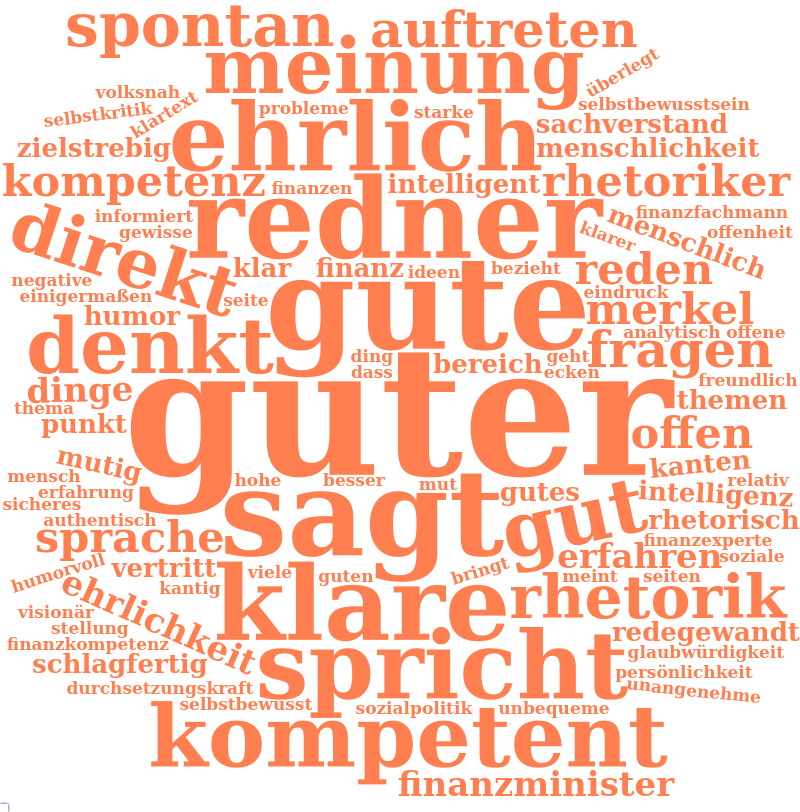
Angaben nach dem TV-Duell:
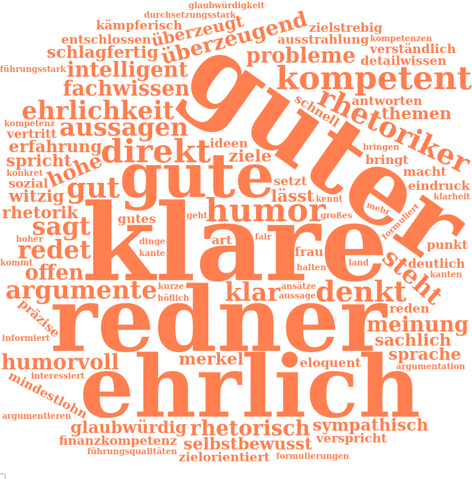
Tabelle der häufigsten Äußerungen:

```r
kable(data.frame(headS1, headS3, check.names = FALSE, row.names = NULL), caption = "Angaben über positive Eigenschaften von Peer Steinbrück") %>% kable_styling(bootstrap_options = c("striped", "hover", "condensed")) %>% 
  add_header_above(header = c("Vor dem TV-Duell" = 2, "Nach dem TV-Duell" =2))
```

<table class="table table-striped table-hover table-condensed" style="margin-left: auto; margin-right: auto;">
<caption>Angaben über positive Eigenschaften von Peer Steinbrück</caption>
 <thead>
<tr>
<th style="border-bottom:hidden; padding-bottom:0; padding-left:3px;padding-right:3px;text-align: center; " colspan="2"><div style="border-bottom: 1px solid #ddd; padding-bottom: 5px; ">Vor dem TV-Duell</div></th>
<th style="border-bottom:hidden; padding-bottom:0; padding-left:3px;padding-right:3px;text-align: center; " colspan="2"><div style="border-bottom: 1px solid #ddd; padding-bottom: 5px; ">Nach dem TV-Duell</div></th>
</tr>
  <tr>
   <th style="text-align:left;"> word </th>
   <th style="text-align:right;"> freq </th>
   <th style="text-align:left;"> word </th>
   <th style="text-align:right;"> freq </th>
  </tr>
 </thead>
<tbody>
  <tr>
   <td style="text-align:left;"> guter </td>
   <td style="text-align:right;"> 21 </td>
   <td style="text-align:left;"> klare </td>
   <td style="text-align:right;"> 26 </td>
  </tr>
  <tr>
   <td style="text-align:left;"> gute </td>
   <td style="text-align:right;"> 15 </td>
   <td style="text-align:left;"> guter </td>
   <td style="text-align:right;"> 25 </td>
  </tr>
  <tr>
   <td style="text-align:left;"> sagt </td>
   <td style="text-align:right;"> 14 </td>
   <td style="text-align:left;"> redner </td>
   <td style="text-align:right;"> 22 </td>
  </tr>
  <tr>
   <td style="text-align:left;"> redner </td>
   <td style="text-align:right;"> 13 </td>
   <td style="text-align:left;"> ehrlich </td>
   <td style="text-align:right;"> 21 </td>
  </tr>
  <tr>
   <td style="text-align:left;"> klare </td>
   <td style="text-align:right;"> 12 </td>
   <td style="text-align:left;"> gute </td>
   <td style="text-align:right;"> 15 </td>
  </tr>
  <tr>
   <td style="text-align:left;"> ehrlich </td>
   <td style="text-align:right;"> 11 </td>
   <td style="text-align:left;"> direkt </td>
   <td style="text-align:right;"> 8 </td>
  </tr>
  <tr>
   <td style="text-align:left;"> spricht </td>
   <td style="text-align:right;"> 11 </td>
   <td style="text-align:left;"> humor </td>
   <td style="text-align:right;"> 8 </td>
  </tr>
  <tr>
   <td style="text-align:left;"> kompetent </td>
   <td style="text-align:right;"> 10 </td>
   <td style="text-align:left;"> kompetent </td>
   <td style="text-align:right;"> 8 </td>
  </tr>
  <tr>
   <td style="text-align:left;"> denkt </td>
   <td style="text-align:right;"> 9 </td>
   <td style="text-align:left;"> denkt </td>
   <td style="text-align:right;"> 7 </td>
  </tr>
  <tr>
   <td style="text-align:left;"> gut </td>
   <td style="text-align:right;"> 9 </td>
   <td style="text-align:left;"> gut </td>
   <td style="text-align:right;"> 7 </td>
  </tr>
</tbody>
</table>
  
Bei den genannten positiven Eigenschaften gibt es einige klare Veränderungen nach dem Treatment der Probanden. So verdoppelt sich etwa nach dem Duell das verstärkende Adjektiv _klare_ von 12 auf 26 Nennungen. Auch die Nennung _gute_ kommt um 10 Nennungen häufiger vor. Vermutlich besteht hier ein Zusammenhang mit dem Wort _redner_, da dieses ebenfalls um 11 Nennungen ansteigt. Allgemein ergeben sich hier geringere Änderungen als bei Frau Merkel; es tauchen keine neuen Begriffe in den zehn häufigsten Nennungen auf.

Allgemein lässt sich der positive Eindruck von Peer Steinbrück als einen _guten_ und _klaren_ _Redner_ mit einer _ehrlichen_ Ausstrahlung zusammenfassen.
  
### Negative Eigenschaften
  
Bei den Angaben der negativen Eigenschaften Peer Steinbrücks herrscht hingegen eine relativ deutliche Verschiebung der genannten Wörter – das TV-Duell scheint einen klaren Einfluss auf den Eindruck des Kandidaten gehabt zu haben:

Angaben über negative Eigenschaften von Peer Steinbrück vor dem TV-Duell:
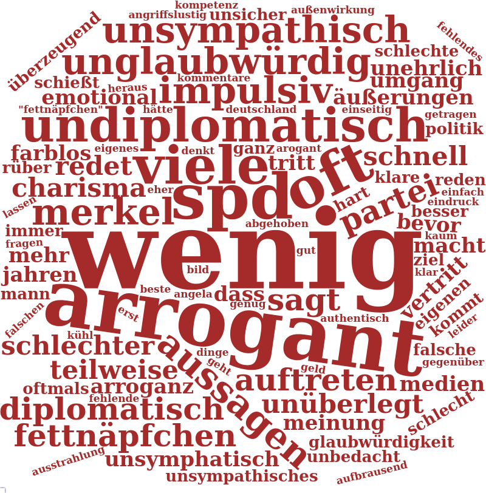
Angaben nach dem TV-Duell:

Tabelle der häufigsten Äußerungen:
  

```r
kable(data.frame(headS2, headS4, check.names = FALSE, row.names = NULL), caption = "Angaben über positive Eigenschaften von Peer Steinbrück") %>% kable_styling(bootstrap_options = c("striped", "hover", "condensed")) %>% 
  add_header_above(header = c("Vor dem TV-Duell" = 2, "Nach dem TV-Duell" =2))
```

<table class="table table-striped table-hover table-condensed" style="margin-left: auto; margin-right: auto;">
<caption>Angaben über positive Eigenschaften von Peer Steinbrück</caption>
 <thead>
<tr>
<th style="border-bottom:hidden; padding-bottom:0; padding-left:3px;padding-right:3px;text-align: center; " colspan="2"><div style="border-bottom: 1px solid #ddd; padding-bottom: 5px; ">Vor dem TV-Duell</div></th>
<th style="border-bottom:hidden; padding-bottom:0; padding-left:3px;padding-right:3px;text-align: center; " colspan="2"><div style="border-bottom: 1px solid #ddd; padding-bottom: 5px; ">Nach dem TV-Duell</div></th>
</tr>
  <tr>
   <th style="text-align:left;"> word </th>
   <th style="text-align:right;"> freq </th>
   <th style="text-align:left;"> word </th>
   <th style="text-align:right;"> freq </th>
  </tr>
 </thead>
<tbody>
  <tr>
   <td style="text-align:left;"> wenig </td>
   <td style="text-align:right;"> 21 </td>
   <td style="text-align:left;"> arrogant </td>
   <td style="text-align:right;"> 15 </td>
  </tr>
  <tr>
   <td style="text-align:left;"> arrogant </td>
   <td style="text-align:right;"> 15 </td>
   <td style="text-align:left;"> manchmal </td>
   <td style="text-align:right;"> 13 </td>
  </tr>
  <tr>
   <td style="text-align:left;"> manchmal </td>
   <td style="text-align:right;"> 14 </td>
   <td style="text-align:left;"> oft </td>
   <td style="text-align:right;"> 10 </td>
  </tr>
  <tr>
   <td style="text-align:left;"> spd </td>
   <td style="text-align:right;"> 12 </td>
   <td style="text-align:left;"> wenig </td>
   <td style="text-align:right;"> 10 </td>
  </tr>
  <tr>
   <td style="text-align:left;"> oft </td>
   <td style="text-align:right;"> 11 </td>
   <td style="text-align:left;"> impulsiv </td>
   <td style="text-align:right;"> 9 </td>
  </tr>
  <tr>
   <td style="text-align:left;"> viele </td>
   <td style="text-align:right;"> 10 </td>
   <td style="text-align:left;"> aussagen </td>
   <td style="text-align:right;"> 8 </td>
  </tr>
  <tr>
   <td style="text-align:left;"> undiplomatisch </td>
   <td style="text-align:right;"> 9 </td>
   <td style="text-align:left;"> merkel </td>
   <td style="text-align:right;"> 7 </td>
  </tr>
  <tr>
   <td style="text-align:left;"> aussagen </td>
   <td style="text-align:right;"> 7 </td>
   <td style="text-align:left;"> arroganz </td>
   <td style="text-align:right;"> 6 </td>
  </tr>
  <tr>
   <td style="text-align:left;"> impulsiv </td>
   <td style="text-align:right;"> 7 </td>
   <td style="text-align:left;"> partei </td>
   <td style="text-align:right;"> 6 </td>
  </tr>
  <tr>
   <td style="text-align:left;"> merkel </td>
   <td style="text-align:right;"> 7 </td>
   <td style="text-align:left;"> ausstrahlung </td>
   <td style="text-align:right;"> 5 </td>
  </tr>
</tbody>
</table>
  
Die häufigste Nennung _wenig_ ist in der nachgeordneten Erhebung von 21 Nennungen auf weniger als die Hälfte der Nennungen abgerutscht. Nicht mehr in den Top 10 der Nennungen anzutreffen ist ebenfalls der begriff _spd_ – vielleicht ist SPD-Zugehörigkeit des Kandidaten im Duell ersichtlicher und demzufolge nicht mehr herauszustellenswert. Ebenfalls um mehr als 10 Zähler abgenommen hat der Eindruck des Kandidaten als _arrogant_ - eine sehr negative Eigenschaft eines potenziellen Bundeskanzlers. Relativ gleich geblieben sind Häufigkeiten des Betitelns Steinbrücks als _impulsiv_, _manchmal_ und _aussagen_.

Zusammengefasst ergibt sich nach dem TV-Duell ein negatives Bild Steinbrücks, dass an Arroganz abbauen konnte und als etwas gemäßigter und abwägender gesehen wird (_manchmal_).

# Sentimentanalyse mit sentiWS

Nachdem das wahrgenommene Bild der Kandidaten ausgiebig scharf gestellt wurde, wird sich dieser Abschnitt mit der positiven und negativen Aussagekraft der Kandidateneigenschaften befassen.
  
Mit der Technik der sogenannten _Sentimentsanalyse_ ist es möglich, für Textformen jeglicher Art und Länge eine allgemeine positive oder negative Einstellung des Textverfassers zu identifizieren und mit einem Wert zu versehen. Hierzu wird zuvor manuell ein großer tabellarischer Corpus an positiven und negativen Wörtern erstellt. Jedes einzelne der ausgewählten Wörter bekommt daraufhin einen bestimmten positiven oder negativen Wert im Intervall -1 bis 1 zugewiesen, wobei -1 eine maximal negative Polarität und 1 eine maximal positive Polarität des Begriffes ausdrückt. Je nachdem, welche Werte die einzelnen Worte eines Textstückes haben, kann dieses nach Umrechnung in diese Sentiments-werte einen numerisch positiven oder negativen Wert aufweisen und so offenlegen, welche *Grundstimmung* das Textstück aufweist.
  
Eine solche Sentiments-Tabelle soll nun herangezogen werden, um die Nennungen der positiven und negativen Kandidateneigenschaften in einen jeweiligen *Score* zu überführen. So wird ersichtlich, über welchen Kandidaten die Studienteilnehmer positiver oder negativer denken und ob der Einfluss des Treatments etwas an dieser Einstellung ändert.
  
Die Grundlage für diese Sentimentsanalyse bietet das deutsche Projekt SentimentWortschatz (_SentiWS_) der Universität Leipzig [@remus_sentiws_2010]. Der Wortschatz besteht aus 15.649 positiven und 15.632 negativen Wörtern, welche alle entsprechend mit einem Wert assoziiert wurden.
  
Die Corpus-Daten sind kostenlos auf der Website der Uni Leipzig beziehbar und können automatisiert in R importiert werden. Die Hauptschwierigkeit ist es, die sentiWS Dateien in ein für die weitere Analyse passendes Format zu bekommen:


```r
# Laden des aktuellen Wortschatzes von den Seiten der Uni-Leipzip
sentiWS_zip <- paste(dirsentiWSFiles, "/SentiWS_v1.8c.zip", sep = "")
download.file(url = "http://pcai056.informatik.uni-leipzig.de/downloads/etc/SentiWS/SentiWS_v1.8c.zip", 
    destfile = sentiWS_zip)
unzip(sentiWS_zip, exdir = dirsentiWSFiles)

# Pfad zu den entpackten Dateien
sentiWS_P <- paste(dirsentiWSFiles, "SentiWS_v1.8c_Positive.txt", sep = "/")

# Workaround für Bug: fread kann nicht mit verschiedenen Seperatoren umgehen.
# Deshalb: readr benutzen
require(readr)
# Bennenne die Spalten
sentiWS_P_colnames <- c("word", "value", "alias")  # Benenne die Columns

# !!!  Achtung: read_tsv nimmt keine Variable als Dateipfad, hier unbedingt den
# Pfad aus 'sentiWS_P' einfügen!

sentiWS_P <- read_tsv(sentiWS_P, col_names = sentiWS_P_colnames, trim_ws = TRUE)
```

```
## Parsed with column specification:
## cols(
##   word = col_character(),
##   value = col_double(),
##   alias = col_character()
## )
```

```r
# Neue Spalte für Wortart hinzufügen
sentiWS_P <- mutate(sentiWS_P, type = word)
# Lösche Teil des Wortes mit Regex aus Wortart-Spalte
sentiWS_P$type <- gsub(".+[|]", "\\1", sentiWS_P$type)
# Lösche die Wortart aus der ersten Spalte
sentiWS_P$word <- gsub("[|].+", "\\1", sentiWS_P$word)

# Die Synonyme in die erste Spalte bekommen und den Wert übernehmen
# install.packages('splitstackshape')
require(data.table)
require(splitstackshape)

sentiWS_Ptest <- as.data.frame(sentiWS_P)
# Merge die Synonymspalte mit der Wort-Spalte und ersetze die ursprüngliche
# Wort-Spalte
sentiWS_Ptest <- unite(sentiWS_Ptest, word, c(word, alias), remove = TRUE, sep = ",")
# Lösche die NA aus der neuen Spalte, damit das Mergen funktioniert, konvertiere
# zu Kleinbuchstaben
sentiWS_Ptest$word <- tolower(gsub("NA", "\\1", sentiWS_Ptest$word))
# Trenne die neue Spalte nach Kommas und übernehme für die neuen Reihen die Werte
# der Originalen
sentiWS_Ptest <- cSplit(sentiWS_Ptest, "word", sep = ",", direction = "long")

# Die Vorbereitungen für die positiven Sedimente sind abgeschlossen. Jetzt das
# ganze nochmal mit den negativen sentiWS-Werten im Hintergrund. Der Prozess ist
# derselbe wie für die positiven Sentimente.
```


```
## Parsed with column specification:
## cols(
##   word = col_character(),
##   value = col_double(),
##   alias = col_character()
## )
```
   
 Nach diesen umfangreichen Rechenoperationen existieren nun eine positive und eine negative Senitmentsliste. Im nächsten Schritt sollen diese Listen mit den positiven und negativen Eigenschaften der Kandidaten abgeglichen werden, um so einen _Score_ pro Kandidat zu erhalten:
  

```r
# Merge die Sentimentstabelle und die Eigenschaftentabelle, die wir weiter oben
# bei der Wordcloud erstellt haben, bei gleichen Worten = verwerfe die anderen
# Werte
sent_M_A_Pos <- merge(sentiWS_Ptest, EGSa_M_positiv_fin, by = "word")
# Multipliziere den Wert des Wortes mit der Frequency und füge ihn in einer neuen
# Spalte hinzu
sent_M_A_Pos <- mutate(sent_M_A_Pos, score = value * freq)
# Errechne die Summe der score-Spalte - das ist der Kandidatenwert

sent_M_A_Pos_score <- sum(sent_M_A_Pos$score)  # Wir haben einen Wert!

# Jetzt der negative Wert - der Ablauf bleibt derselbe

sent_M_A_neg <- merge(sentiWS_Ntest, EGSa_M_negativ_fin, by = "word")
sent_M_A_neg <- mutate(sent_M_A_neg, score = value * freq)

sent_M_A_neg_score <- sum(sent_M_A_neg$score)

# Addiere den negativen und den Positiven Score - unser Kandidatenwert

Score_Merkel_A <- sent_M_A_Pos_score + sent_M_A_neg_score
```

## Rohdaten der Analyse

Der errechnete Wert für die Wahrnehmung Angela Merkels beträgt demnach:

```r
Score_Merkel_A
```

```
## [1] 39.4651
```

Für sich alleine ist dieser Wert jedoch noch nicht aussagekräftig – erst im Vergleich mit den Werten der anderen Erhebungswelle und mit dem _Score_ Peer Steinbrücks ergeben sich Interpretationsmöglichkeiten.

Wie gehabt fahren wir deshalb mit derselben Methode für die anderen Wellen und Kandidaten im Hintergrund fort.
Der Score Merkels aus Welle B beträgt

```
## [1] 32.1073
```
, ein leichter Abfall gegenüber dem Wert der ersten Erhebung. Die Kandidatin auf Grundlage dieser Berechnung durch TV-Duell demnach klar an Sympathie verloren.

Anders verhält es sich beim Herausforderer Peer Steinbrück: Mit einem _Score_ von

```
## [1] 3.0578
```
in Welle A und einem Score von

```
## [1] 15.4608
```
in Welle B konnte Steinbrück klar an Symphatie gewinnen. Zur Verdeutlichung dieser Werte werden diese im nachfolgenden grafisch aufbereitet.

## Grafische Aufbereitung und Vergleich der Kandidatenwerte
  
### Angela Merkel

```r
# Konvertiere die Sentimentsscores in einen Dataframe
s_werte_merkel_A <- data.frame(sent_M_A_Pos_score, sent_M_A_neg_score, Score_Merkel_A)
colnames(s_werte_merkel_A) <- c("Positiv", "Negativ", "Summe")
s_werte_merkel_B <- data.frame(sent_M_B_Pos_score, sent_M_B_neg_score, Score_Merkel_B)
colnames(s_werte_merkel_B) <- c("Positiv", "Negativ", "Summe")

s_werte_merkel <- full_join(s_werte_merkel_A, s_werte_merkel_B)
```

```
## Joining, by = c("Positiv", "Negativ", "Summe")
```

```r
# Weise Spalte für die Erhebungswellen zu
s_werte_merkel$Welle <- c("Welle A", "Welle B")

# Erstelle Balkendiargramm
ggplot(s_werte_merkel) + geom_col(aes(x = Welle, y = Summe, fill = Summe), position = "dodge") + 
    geom_text(data = s_werte_merkel, aes(x = Welle, y = Summe, label = Summe, vjust = -0.6, 
        colour = Summe), size = 4, position = position_dodge(width = 0.9)) + labs(x = "Bewertung der Eigenschaften Merkel", 
    y = "sentiWS-Score") + theme(legend.position = "none", legend.title = element_blank())
```

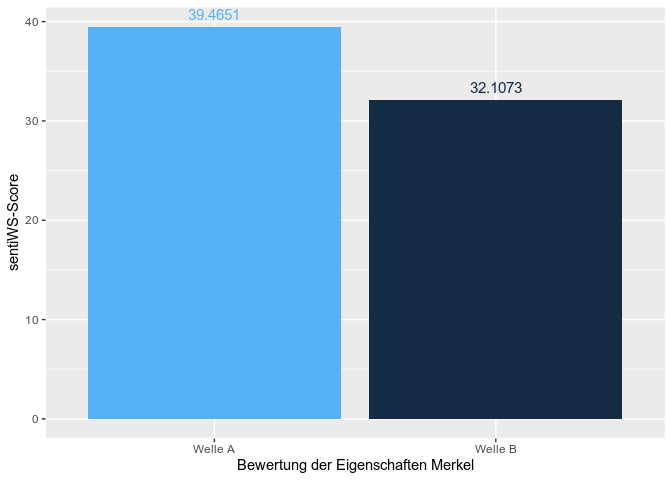<!-- -->
  
Im Vergleich der beiden Erhebungswellen fällt der zweite für Angela Merkel erhobene summierte _Score_ aus Negativ- und Positivkategorisierungen um 6 Punkte ab – die Teilnahme am TV-Duell hat der Kandidaten auf Grundlage dieser Daten demnach geschadet.
  
Etwas ersichtlicher wird diese Verschiebung bei dem Vergleich der negativen und positiven _Scores_ nach Wellen, welcher im Folgenden erstellt wird:
  

```r
# Erstelle multiplot für positiv und negativwert der Wellen
grafik_sent_M_pos <- ggplot(s_werte_merkel) + geom_col(aes(x = Welle, y = Positiv, 
    fill = scorefarbe), position = "dodge") + geom_text(data = s_werte_merkel, aes(x = Welle, 
    y = Positiv, label = Positiv, vjust = -0.6, colour = Positiv), size = 4, position = position_dodge(width = 0.9)) + 
    labs(x = "Positiv-Score", y = "sentiWS-Score") + scale_fill_identity() + theme(legend.position = "none", 
    legend.title = element_blank())

scorefarbe <- c("#56B1F7", "#142B43")

grafik_sent_M_neg <- ggplot(s_werte_merkel) + geom_col(aes(x = Welle, y = Negativ, 
    fill = scorefarbe), position = "dodge") + geom_text(data = s_werte_merkel, aes(x = Welle, 
    y = Negativ, label = Negativ, vjust = -0.6, colour = Negativ), size = 4, position = position_dodge(width = 0.9)) + 
    labs(x = "Negativ-Score", y = "sentiWS-Score") + scale_fill_identity() + theme(legend.position = "none", 
    legend.title = element_blank())


multiplot(grafik_sent_M_pos, grafik_sent_M_neg, cols = 2)
```

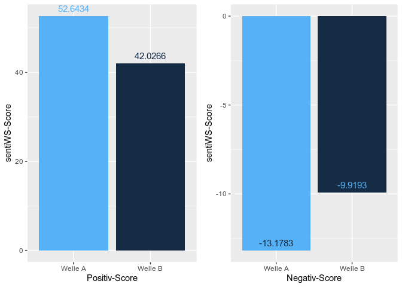<!-- -->
  
Es zeigt sich, dass die Höhe beider Scores unabhängig voneinander abgenommen haben und die Meinungen der Probanden über Angela Merkel gemäßigter geworden sind. Zwar sehen einige Probanden (+3,259 Punkte) Merkel weniger negativ als vor dem TV-Duell, gleichzeitig hat sich aber die Summe des positiven Sentiment-Scores um knapp mehr als 10 Punkte verringert. 

Merkel konnte demzufolge im TV-Duell zwar einige negative Bedenken ausräumen, gleichzeitig gelang es ihr aber nicht ihr positives zu halten oder zu verbessern.

### Peer Steinbrück
  

```
## Joining, by = c("Positiv", "Negativ", "Summe")
```

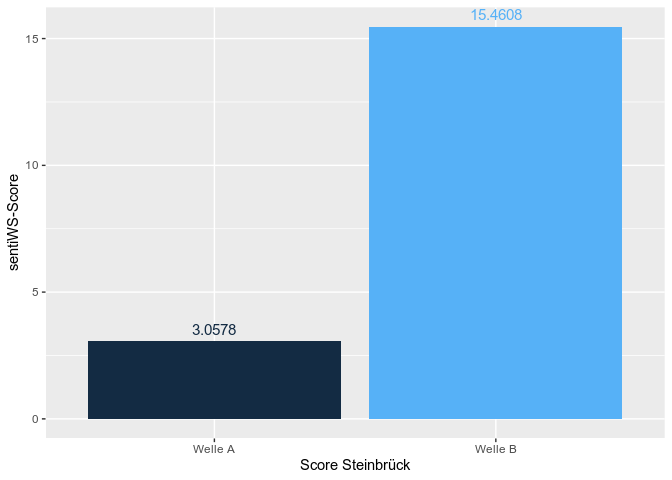<!-- -->

Ganz im Gegenteil zur Amtsinhaberin konnte Peer Steinbrück im Duell um die Kanzlerschaft klar an Sympathiepunkten gewinnen. Sein _sentiWS-Score_ verbesserte sich dramatisch um den Faktor 5 von 3,05 auf 15,46 Punkte. 

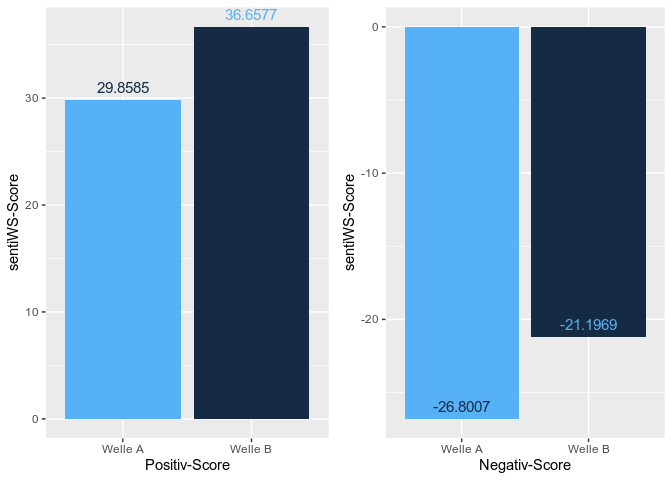<!-- -->

Auch im Vergleich der jeweiligen Werte der Erhebungswellen ist der Sympathiegewinn Steinbrücks erkennbar. Er konnte nicht nur negative Vorurteile abbauen (+5,61 Punkte), sondern im Gegensatz zu Angela Merkel auch deutlich bei den Positivwerten zulegen (+6,8 Punkte). Ginge es nur nach den Sentiment-Scores, hätte Peer Steinbrück das TV-Duell 2013 demnach klar gewonnen.

Im Angesicht dieser Erkenntnisse kann die für diese Arbeit aufgestellte Arbeitshypothese (2), nach welcher die direkte Auseinandersetzung mit dem jeweiligen Spitzenkandidaten im Originalton des TV-Duells den Eindruck des Kandidaten auf den Zuschauer positiv beeinflusst, nunmehr angenommen werden.

# Fazit und Ausblick

Zusammenfassend lässt sich sagen, dass die untersuchten Daten der GESIS-Studie zum TV-Duell der Bundestagswahl 2013 einige interessante Einblicke offenbaren. Zunächst vermeintlich klar verteilte Variablen wie etwa der Einfluss des TV-Duells auf die Absicht der TeilnehmerInnen, an der Bundestagswahl teilzunehmen, erwiesen sich in der Analyse als keineswegs Aussagekräftig: Nur ein einzelner Befragter änderte nach dem Beiwohnen des TV-Duells seine Antwort bei dieser Frage – oder vergaß schlicht, diese auszufüllen.

Die allgemeine Auswahlgesamtheit der GESIS-Studie bewegt sich vom Altersdurchschnitt sehr nah am deutschen Gesamtbevölkerungsschnitt. Auch beim Geschlecht und der Verbindung von diesem mit dem Bildungsniveau herrscht eine fast vollständige Gleichheit bei der Gruppengröße.

Im Bezug auf die Einkommensarten in Verknüpfung mit dem Geschlecht konnten jedoch klare Unterschiede ausgemacht werden: Frauen unter den TeilnehmerInnen waren im Schnitt deutlich weniger Vollbeschäftigt und machten deutlich häufiger keine Angaben zu ihrer Einkommensart – die Bezeichnung _Hausfrau_ gaben sich auffallend wenige Teilnehmerinnen.

Bei Parteipräferenz und Alter existiert eine klare Bevorzugung der SPD, dicht gefolgt von denjenigen Probanden die angeben, keiner Partei besonders zugeneigt zu sein oder überhaupt keine Angaben machten. Die Hypothese, dass ältere Menschen im allgemeinen konservativeren Parteien zuneigen muss auf Grundlage der vorliegenden Ergebnisse verneint werden – ähnliche Tendenzen konnten auch bei unkonservativen Parteien beobachtet werden.
  
Ein starker Einfluss des TV-Duells wurde jedoch bei der Sicherheit der Wahlentscheidung deutlich: Eine Großzahl gaben ein anderes Level der Sicherheit über ihre kommende Wahlentscheidung an, nachdem sie dem TV-Duell beigewohnt hatten.

Im Hauptteil der Arbeit konnte mittels einer explorativen Datenanalyse nachgewiesen werden, das sich die Wahrnehmung der Kandidaten und das Zuschreiben von Eigenschaften auf diese durch das TV-Duell in einigen Fällen stärker und in anderen Fällen schwächer verschoben hat.  Vor allem Peer Steinbrück konnte bei dieser Frage Punkten und negative Ressentiments durch das TV-Duell abbauen.
Mittels einer Sentimentanalyse auf Grundlage des deutschen Corpus _SentiWS_ wurden diese erhobenen Eigenschaften mit positiven und negativen Bewertungen einzelner Wörter in Verbindung gebracht. Hier hat sich ein klarer Unterschied zwischen den Kandidaten und ein klarer Einfluss des TV-Duells auf die subjektive Beurteilung der Kandidaten ergeben: Während Angela Merkel durch das TV-Duell primär die Wogen glätten konnte, bei der Häufigkeit der Nennungen positiv konnotierter Wörter jedoch starke Einbußen hinnehmen musste, gelang es Peer Steinbrück sowohl negative Werte abzubauen und seien Positiv-Score stark zu verbessern. Nimmt man allein diesen Wert zugrunde, hat Peer Steinbrück durch die Teilnahme am TV-Duell 2013 beim Wähler stark an Sympathie gewonnen.

Abschließend bleibt noch ein Blick auf die Aussagekraft der erstellten Analyse und mögliche Weiterentwicklungen der angewandten Methoden:
Da die vorliegende GESIS-Studie nur mit einer Zahl von 268 Teilnehmern durchgeführt wurde, sind trotz der Sorgfalt und der geschehenen Anwendung eines Auswahlschlüssels zur Wahrung der Repräsentativität aussagen über diese nur mit Vorsicht zu treffen und können im Rahmen dieser Untersuchung nicht getroffen werden. Bei mehreren Millionen Fernsehzuschauern, die das Duell live im Fernsehen verfolgt haben, können die Meinungen und wahrgenommenen Eigenschaften der beiden Kandidaten viel weiter auseinander liegen, als dies im vorliegenden Datensatz der Fall ist, welcher unter kontrollierten Bedingungen an Universitäten erhoben wurde.
Weiterhin ist die Zahl der analysierten Variablen in dieser Untersuchung nicht ausreichend, um ein umfassendes Bild über den Einfluss des TV-Duells auf die beiden Erhebungswellen zeichnen zu können. Der Fokus des explorativen Charakters dieser Arbeit liegt vor allem darauf, neue Möglichkeiten zur Bewertung dieses impact aufzuzeigen.
  
Einige mögliche Weiterentwicklungen dieser Untersuchung umfassen etwa die Mitaufnahme der Sentimentsdaten für die Kandidateneigenschaften pro Proband in das originale Datenset, um direkt in der Tabelle den positiven oder negativen Kandidateneindruck ablesen zu können und mit anderen Variablen in Verbindung zu bringen.  
  
Weiterhin wäre ein Abgleich mit der Kontrollgruppe ohne Treatment der Studie notwendig, um fundierte Aussagen über den tatsächlichen Effekt des TV-Duells auf die Antworten der StudienteilnehmerInnen geben zu können. Auch das Zusammenfassen von Synonymen in den Eigenschaften der Kandidaten könnte der Aussagekraft dieser Analyseart förderlich sein, konnte aber aus Zeit- und Umfang-gründen nicht mehr vollzogen werden. Auch der Vergleich mit den TV-Duellen anderer Jahre musste aus Zeitgründen leider verworfen werden, die entsprechenden Datensätze für das Jahr 2009 befinden sich jedoch bereits in aufbereiteter Form im Dokument.

Das Forschungsfeld des Einflusses von TV-Duellen verspricht auch in Zukunft ein spannendes Betätigungsfeld für Sozialwissenschaftlerinnen und Sozialwissenschaftler zu bleiben und man darf gespannt sein, welche innovativen Methoden in Zukunft neue Erkenntnisse über die Beeinflussung der Zuschauer in ihrer Stimmabgabe liefern werden.
  
                                
# Literaturverzeichnis

@article{dehm_fernsehduelle_2002,
 author = {Dehm, Ursula},
 year = {2002},
 title = {Fernsehduelle im Urteil Der Zuschauer},
 pages = {600--609},
 number = {12},
 journal = {Media Perspektiven}
}


@article{dehm_tv_2009,
 author = {Dehm, Ursula},
 year = {2009},
 title = {Das TV-Duell 2009 aus Zuschauersicht. Dreistufige Befragung zum Wahlduell zwischen Kanzlerin Angela Merkel und Herausforderer Frank-Walter Steinmeier},
 url = {https://www.ard-werbung.de/fileadmin/user_upload/media-perspektiven/pdf/2009/12-09_Dehm.pdf},
 pages = {651--661},
 number = {12},
 journal = {Media Perspektiven}
}


@misc{destatis_bevolkerungsstand_2011,
 author = {DESTATIS},
 date = {2011},
 title = {Bev{\"o}lkerungsstand - Durchschnittsalter nach Geschlecht und Staatsangeh{\"o}rigkeit auf Grundlage des Zensus 2011},
 url = {https://www.destatis.de/DE/ZahlenFakten/GesellschaftStaat/Bevoelkerung/Bevoelkerungsstand/Tabellen/Durchschnittsalter_Zensus.html}
}


@article{Goerres_2010,
 abstract = {[The German electorate is constantly aging. Hence, knowing about age-related effects on voting behavior becomes more important. Empirical findings on this issue differentiate between generational effects, grounded in political and socio-economic socialization, and age effects, derived from the dynamics of aging, experience and life cycle. On the whole, the results from established democracies paint a complex picture of differences between younger and older voters, both in turnout and voting choice. Thus, any discussion about these differences and their implications for aging democratic societies ought to be led without simplifications.]},
 author = {Goerres, Achim},
 year = {2010},
 title = {Das Wahlverhalten {\"a}lterer Menschen. Forschungsergebnisse aus etablierten Demokratien},
 url = {http://www.jstor.org/stable/24240181},
 pages = {102--120},
 volume = {41},
 number = {1},
 issn = {0340-1758},
 journal = {Zeitschrift f{\"u}r Parlamentsfragen}
}


@article{heuser_tv-duell_2013,
 author = {Heuser, Karl-Heinz},
 year = {2013},
 title = {TV-Duell: Mehr Emotionen wagen},
 url = {https://www.wahl.de/aktuell/2013/09/04/tv-duell-mehr-emotion-wagen/},
 urldate = {22.01.2018}
}


@incollection{maier_basis_2007,
 author = {Maier, J{\"u}rgen},
 title = {Eine Basis f{\"u}r rationale Wahlentscheidungen? Die Wirkungen des TV-Duells auf politische Kenntnisse},
 pages = {129--143},
 publisher = {{VS Verlag f{\"u}r Sozialwissenschaften}},
 isbn = {978-3-531-15137-3},
 booktitle = {Schr{\"o}der gegen Merkel},
 year = {2007},
 address = {Wiesbaden},
 doi = {10.1007/978-3-531-90709-3{\textunderscore }7}
}


@article{maier_aufgeholt_2014-1,
 author = {Maier, J{\"u}rgen and Faas, Thorsten and Maier, Michaela},
 year = {2014},
 title = {Aufgeholt, aber nicht aufgeschlossen: Wahrnehmungen und Wirkungen von TVDuellen am Beispiel von Angela Merkel und Peer Steinbr{\"u}ck 2013},
 pages = {38--54},
 volume = {45},
 number = {1},
 issn = {0340-1758},
 journal = {Zeitschrift f{\"u}r Parlamentsfragen},
 doi = {10.5771/0340-1758-2014-1-38}
}


@misc{rattinger_tv-duell-analyse_2015,
 author = {Rattinger, Hans and Ro{\ss}teutscher, Sigrid and Schmitt-Beck, R{\"u}diger and We{\ss}els, Bernhard and Wolf, Christof and Faas, Thorsten and Maier, J{\"u}rgen and Maier, Michaela},
 title = {TV-Duell-Analyse Befragung (GLES 2013)},
 year = {2015},
 doi ={10.4232/1.12287},
 institution = {{GESIS Data Archive, Cologne}}
}


@proceedings{remus_sentiws_2010,
 year = {2010},
 title = {SentiWS - a Publicly Available German-Language Resource for Sentiment Analysis.},
 url = {http://www.lrec-conf.org/proceedings/lrec2010/pdf/490_Paper.pdf},
 editor = {Remus and Quasthoff and Heyer}
}


